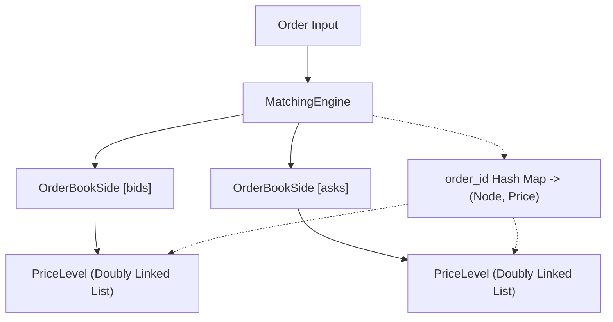

# Limit Order Book Design & Architecture

## 1. Architecture Overview



## 2. Data Structure Comparison

| Implementation | Insert (Resting) | Cancel Order | Match (per Fill) | Best Price Lookup |
| :--- | :--- | :--- | :--- | :--- |
| **Tier 1: Naive List** | $O(N \log N)$ | $O(N)$ | $O(N)$ | $O(1)$ |
| **Tier 2: SortedDict + DLL** | $O(\log P)$ | $O(1)$ | $O(1)$ | $O(1)$ |
| **Tier 3: Tick-Indexed Array** | $O(1)$ | $O(1)$ | $O(1)$ | $O(1)$ |

*(Where $N$ = total orders in book, $P$ = number of distinct active price levels).*

- **Tier 1 (Naive List)**: Stores un-indexed orders in a flat list, sorting or scanning on mutations. Too slow for production, but trivial semantics make it an ideal test oracle.
- **Tier 2 (SortedDict + DLL)**: Prices are sorted in a red-black/B-tree structure (`SortedDict`), each pointing to a `PriceLevel` doubly linked list. An auxiliary hash map tracks `order_id -> Node` for $O(1)$ mid-queue deletions.
- **Tier 3 (Tick-Indexed Array)**: Direct memory indexing where each tick offset (`(price - min) / tick_size`) maps directly to a price level. Eliminates tree overhead, requiring bounded price ranges.

## 3. Why DLL Over Deque?

`collections.deque` provides $O(1)$ push and pop operations at sequence boundaries, which satisfies head-of-line FIFO execution. However, real exchange order books experience cancellation rates that far exceed fills. Cancelling an arbitrary order resting inside a `deque` requires an $O(N)$ linear search and memory shift. A Doubly Linked List (DLL) combined with an `order_id -> Node` hash map enables $O(1)$ pointer-splicing cancellation from any queue position without linear scans.

## 4. Matching Algorithm

```python
while order.remaining_qty > 0 and not opposite_side.is_empty():
    level = opposite_side.best_level()
    if not crosses(order, level.price): break
    resting = level.front()
    fill_qty = min(order.remaining_qty, resting.remaining_qty)
    execute_trade(order, resting, level.price, fill_qty)
    if resting.remaining_qty == 0: opposite_side.remove(resting.order_id)
```

## 5. Order Types

| Type | Immediate Match? | Rests on Book? | Remainder Handling | Pre-flight Depth Check |
| :--- | :--- | :--- | :--- | :--- |
| **LIMIT** | Yes (if price crosses) | Yes | Placed in book at limit price | No |
| **MARKET** | Yes (best prices) | No | Cancelled if liquidity exhausted | No |
| **IOC** | Yes (up to limit price) | No | Unfilled quantity cancelled immediately | No |
| **FOK** | Yes (complete fill only)| No | Entire order cancelled if depth < quantity | Yes |

## 6. Performance & Systems Architecture

- **Python Ceiling**: GIL overhead, object allocations, dynamic typing, and pointer chasing limit Python's throughput to ~40k–80k ops/sec with 15–30µs median latency.
- **C++ / Rust Production Design**:
  - **Flat Contiguous Memory**: Arena-allocated or flat array slotmaps to eliminate pointer chasing and maximize CPU L1/L2 cache hits.
  - **Zero Allocations**: Pre-allocated object pools and ring buffers on the hot matching path.
  - **Fixed-Point Math**: Integer tick representations (`uint64_t`) instead of floating-point values to avoid IEEE-754 precision issues and costly branching.
  - **Single-Thread Pinning**: Dedicated core with kernel-bypass networking (Solarflare OpenOnload / DPDK) achieving <1µs determinism at 1M+ ops/sec.

## 7. Testing & Invariant Validation

- **Property-Based Testing (`hypothesis`)**: Stateful fuzzing (`EngineStateMachine`) validates invariants across random command sequences: strictly ordered uncrossed books (`best_bid < best_ask`), non-negative quantities, order lifecycle consistency, and timestamp FIFO integrity.
- **Differential Cross-Validation**: Feeds identical pseudo-random operation streams into both `MatchingEngine` and `NaiveMatchingEngine` (oracle), asserting strict equality across all generated trade logs, prices, and volumes.
